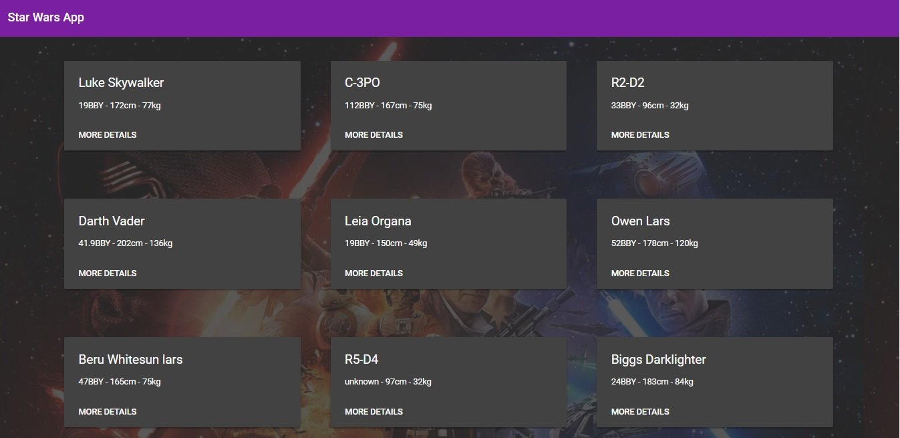
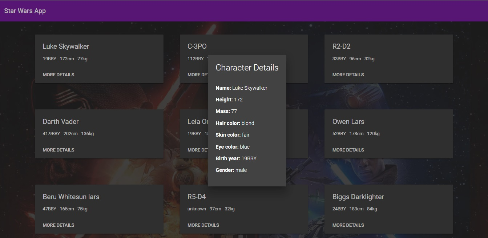

# StarWarsApp

Esse projeto foi gerado com [Angular CLI](https://github.com/angular/angular-cli) versão 1.7.4.

## Servidor de desenvolvimento

Executar o comando `ng serve --open` para rodar a aplicação no navegador. 

## Resultado final

